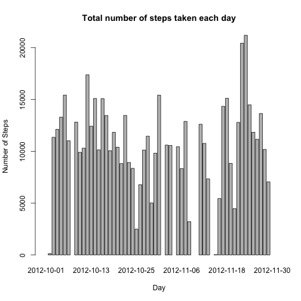
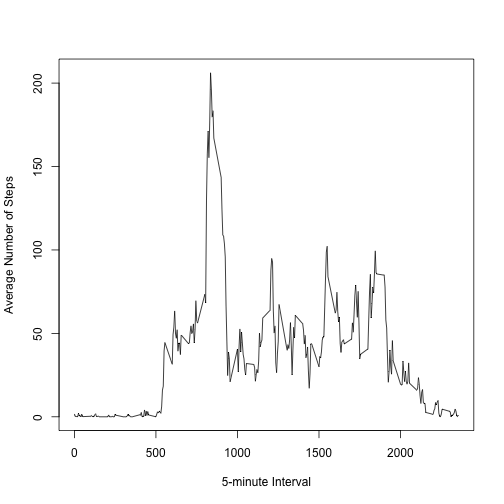
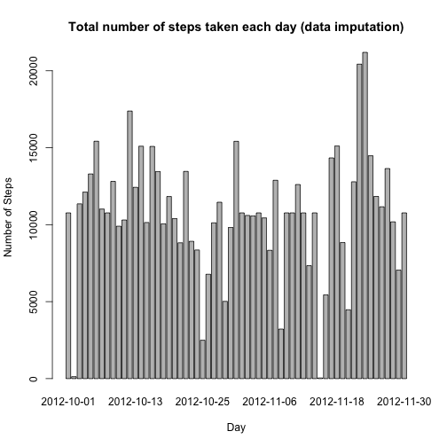
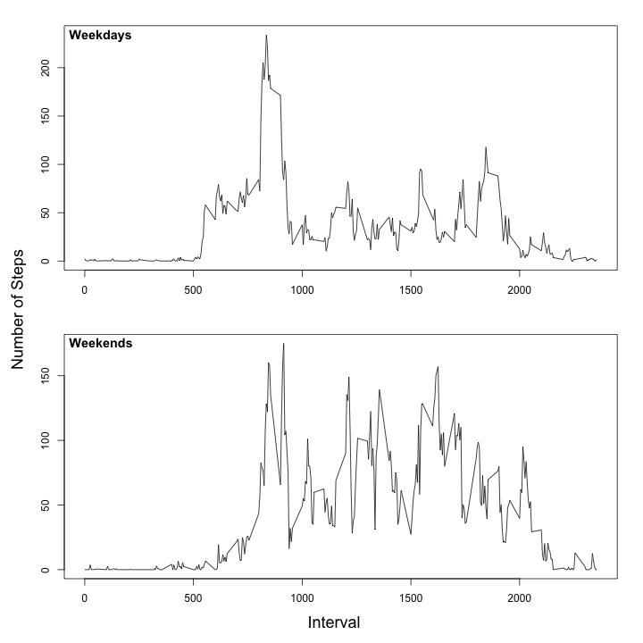

Loading and preprocessing the data

```r
activity <- read.csv("activity.csv")
```

Convert the date column from character to dates 

```r
activity$date <- as.Date(activity$date, "%Y-%m-%d")
```

Calculate the total number of steps taken per day and plot bar graph

```r
daysteps <- with(activity, tapply(steps, date, sum))
barplot(daysteps, ylab = "Number of Steps", xlab = "Day", main = "Total number of steps taken each day")
```



Calculate the mean and median of the total number of steps taken per day

```r
mean(daysteps, na.rm = TRUE)
```

```
## [1] 10766.19
```

```r
median(daysteps, na.rm = TRUE)
```

```
## [1] 10765
```

Plot a time series plot of the 5-minute interval and the average number of steps taken, averaged across all days

```r
agg <- with(activity, 
             aggregate(list("avg.steps"=steps), 
                       list("interval"=interval), 
                       FUN = mean, na.rm = T))
plot(agg$interval, agg$avg.steps, type = "l",
     xlab = "5-minute Interval", ylab = "Average Number of Steps")
```



Which 5-minute interval, on average across all the days in the dataset, contains the maximum number of steps?

```r
agg[which.max(agg$avg.steps),1]
```

```
## [1] 835
```

Total number of missing values in the dataset

```r
sum(is.na(activity))
```

```
## [1] 2304
```

Create a new dataset from the original dataset with the missing data imputed (using means of the interval).

```r
activity.i <- activity
activity.i$steps.i <- ave(activity.i$steps, activity.i$interval, FUN=function(x)
        ifelse(is.na(x), mean(x, na.rm = T), x))
```

Calculate the total number of steps (with imputed data) taken per day and plot bar graph

```r
daysteps.i <- with(activity.i, tapply(steps.i, date, sum))
barplot(daysteps.i, ylab = "Number of Steps", xlab = "Day", main = "Total number of steps taken each day (data imputation)")
```



Calculate the mean and median of the total number of steps taken per day

```r
mean(daysteps.i, na.rm = TRUE)
```

```
## [1] 10766.19
```

```r
median(daysteps.i, na.rm = TRUE)
```

```
## [1] 10766.19
```

What is the impact of imputing missing data on the estimates of the total daily number of steps?

```r
meansteps <- mean(daysteps, na.rm = TRUE)
mediansteps <- median(daysteps, na.rm = TRUE)
meansteps.i <- mean(daysteps.i, na.rm = TRUE)
mediansteps.i <- median(daysteps.i, na.rm = TRUE)
print(paste("percentage change in the mean of daily steps as a result of imputation = ", (meansteps-meansteps.i)/meansteps*100))
```

```
## [1] "percentage change in the mean of daily steps as a result of imputation =  0"
```

```r
print(paste("percentage change in the median of daily steps as a result of imputation = ", (mediansteps-mediansteps)/mediansteps*100))
```

```
## [1] "percentage change in the median of daily steps as a result of imputation =  0"
```

Create a new factor variable in the dataset with two levels – “weekday” and “weekend”
weekdays(activity.i[,2])

```r
activity.i$day.week <- with(activity.i, 
                            ifelse(weekdays(date) %in% c("Sunday", "Saturday"),
                                   "weekend", "weekday"))
```

Create panel plot containing a time series plot of the 5-minute interval (x-axis) and the average number of steps taken, averaged across all weekday days or weekend days (y-axis).

```r
agg.i.weekday <- with(activity.i[activity.i$day.week == "weekday", ],
                      aggregate(list("avg.steps"=steps),
                                list("interval"=interval),
                                FUN = mean, na.rm = T))
agg.i.weekend <- with(activity.i[activity.i$day.week == "weekend", ],
                      aggregate(list("avg.steps"=steps),
                                list("interval"=interval),
                                FUN = mean, na.rm = T))

par(oma=c(2,2,0,0), mar=c(3,3,2,2), mfrow=c(2,1))
plot(agg.i.weekday$interval, agg.i.weekday$avg.steps, type = "l",
     xlab = "", ylab = "",)
title("Weekdays", adj = 0.01, line = -1, font = 1)
plot(agg.i.weekend$interval, agg.i.weekend$avg.steps, type = "l",
     xlab = "", ylab = "",)
title("Weekends", adj = 0.01, line = -1, font = 1)
mtext("Number of Steps", side = 2, outer = T, cex = 1.5)
mtext("Interval", side = 1, outer = T, cex = 1.5)
```


